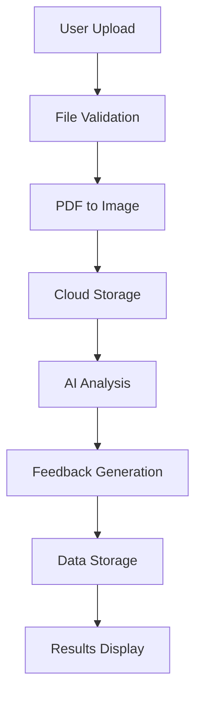

# 🤖 AI Resume Analyzer

> **Resumind** - Your AI-powered resume analysis companion for job applications

[](https://reactjs.org/)
[](https://www.typescriptlang.org/)
[](https://tailwindcss.com/)
[](LICENSE)

## 📋 Table of Contents

- [Overview](#overview)
- [Features](#features)
- [Tech Stack](#tech-stack)
- [Getting Started](#getting-started)
- [Usage](#usage)
- [Architecture](#architecture)
- [API Reference](#api-reference)
- [Deployment](#deployment)
- [Contributing](#contributing)
- [License](#license)

## 🎯 Overview

**Resumind** is a sophisticated AI-powered resume analyzer that helps job seekers optimize their resumes for specific positions. The application leverages advanced AI to provide detailed feedback on resume quality, ATS (Applicant Tracking System) compatibility, and job-specific recommendations.

### Key Benefits

- **🎯 Job-Specific Analysis**: Analyzes resumes against specific job descriptions
- **📊 Multi-Dimensional Scoring**: Comprehensive feedback across multiple categories
- **🤖 AI-Powered Insights**: Advanced AI analysis for actionable recommendations
- **📱 Modern Interface**: Responsive design with intuitive user experience
- **☁️ Cloud-Native**: Built on Puter.com for scalable cloud infrastructure

## ✨ Features

### 🔐 Authentication & User Management
- Secure authentication via Puter.com
- Protected routes with automatic redirects
- Session management and user persistence

### 📄 Resume Upload & Processing
- **Multiple Format Support**: PDF, DOC, DOCX files
- **File Size Limits**: Up to 20MB per file
- **Drag & Drop Interface**: Intuitive file upload experience
- **Real-time Processing**: Live status updates during analysis

### 🤖 AI-Powered Analysis
- **ATS Compatibility Scoring**: Evaluates resume for tracking system optimization
- **Overall Score Assessment**: Comprehensive 0-100 scoring system
- **Multi-Category Feedback**:
  - **Tone & Style**: Professional communication assessment
  - **Content Quality**: Information relevance and completeness
  - **Structure**: Layout and organization evaluation
  - **Skills Assessment**: Technical and soft skills analysis

### 📊 Detailed Feedback System
- **Visual Score Indicators**: Interactive gauges and badges
- **Actionable Tips**: Specific improvement recommendations
- **Category Breakdown**: Detailed analysis per feedback area
- **Good vs. Improve**: Positive reinforcement and improvement areas

### 🎨 Modern User Interface
- **Responsive Design**: Works seamlessly on desktop and mobile
- **Beautiful Animations**: Smooth transitions and loading states
- **Intuitive Navigation**: Clear user flow and navigation
- **Professional Styling**: Modern gradient design system

## 🛠️ Tech Stack

### Frontend
- **React 19.1.0** - Latest React with concurrent features
- **React Router 7.7.0** - Modern routing with data loading
- **TypeScript 5.8.3** - Type-safe development
- **Tailwind CSS 4.1.4** - Utility-first CSS framework
- **Vite 6.3.3** - Fast build tool and dev server

### State Management & Utilities
- **Zustand 5.0.6** - Lightweight state management
- **React Dropzone 14.3.8** - File upload functionality
- **CLSX 2.1.1** - Conditional className utility
- **Tailwind Merge 3.3.1** - Tailwind class merging

### Backend Services
- **Puter.com** - Cloud platform integration
  - Authentication services
  - File storage and management
  - AI analysis capabilities
  - Key-value data storage

### PDF Processing
- **PDF.js 5.3.93** - PDF to image conversion
- **Image processing** - Resume visualization

## 🚀 Getting Started

### Prerequisites

- **Node.js 20+** (LTS recommended)
- **npm** or **yarn** package manager
- **Puter.com account** for backend services

### Installation

1. **Clone the repository**
   ```bash
   git clone https://github.com/yourusername/ai-resume-analyzer.git
   cd ai-resume-analyzer
   ```

2. **Install dependencies**
   ```bash
   npm install
   # or
   yarn install
   ```

3. **Puter.com Integration**
   - The application automatically uses Puter.com's JavaScript SDK
   - No additional configuration required
   - Authentication and services are handled by the SDK

4. **Start development server**
   ```bash
   npm run dev
   # or
   yarn dev
   ```

5. **Open your browser**
   ```
   http://localhost:5173
   ```

### Puter.com Setup

The application uses Puter.com's JavaScript SDK for backend services. The SDK is loaded via script tag in the HTML:

```html
<script src="https://js.puter.com/v2/"></script>
```

No environment variables are required - the SDK handles authentication and service integration automatically.

## 📖 Usage

### 1. Authentication
- Visit the application and click "Log In"
- Authenticate using your Puter.com account
- You'll be redirected to the main dashboard

### 2. Upload Resume
- Navigate to the "Upload" page
- Fill in job details:
  - **Company Name**: Target company
  - **Job Title**: Position you're applying for
  - **Job Description**: Copy the job posting details
- Drag and drop your resume file (PDF/DOC/DOCX)
- Click "Analyze Resume" to start processing

### 3. Review Analysis
- Wait for AI processing (typically 30-60 seconds)
- View comprehensive feedback including:
  - **Overall Score**: 0-100 rating
  - **ATS Score**: Tracking system compatibility
  - **Category Breakdowns**: Detailed analysis per area
  - **Improvement Tips**: Actionable recommendations

### 4. Track Progress
- View all uploaded resumes on the home page
- Access detailed analysis for each submission
- Compare scores across different applications

## 🏗️ Architecture

### Project Structure
```
ai-resume-analyzer/
├── app/
│   ├── components/          # Reusable UI components
│   │   ├── FileUploader.tsx
│   │   ├── ResumeCard.tsx
│   │   ├── Summary.tsx
│   │   ├── ATS.tsx
│   │   └── Details.tsx
│   ├── lib/                # Utilities and services
│   │   ├── puter.ts        # Puter.com integration
│   │   ├── pdf2img.ts      # PDF processing
│   │   └── utils.ts        # Helper functions
│   ├── routes/             # Page components
│   │   ├── home.tsx        # Dashboard
│   │   ├── upload.tsx      # Resume upload
│   │   ├── resume.tsx      # Analysis view
│   │   └── auth.tsx        # Authentication
│   └── root.tsx            # App layout
├── types/                  # TypeScript definitions
├── constants/              # App constants and AI prompts
└── public/                 # Static assets
```

### Data Flow



### State Management
- **Zustand Store**: Centralized state management
- **Puter Integration**: Cloud services abstraction
- **Type Safety**: Comprehensive TypeScript definitions

## 🔧 API Reference

### Puter.com Integration

The application uses Puter.com for backend services:

#### Authentication
```typescript
const { auth } = usePuterStore();
await auth.signIn();
await auth.signOut();
```

#### File Operations
```typescript
const { fs } = usePuterStore();
const file = await fs.upload([file]);
const blob = await fs.read(path);
```

#### AI Analysis
```typescript
const { ai } = usePuterStore();
const feedback = await ai.feedback(filePath, instructions);
```

#### Data Storage
```typescript
const { kv } = usePuterStore();
await kv.set(key, JSON.stringify(data));
const data = await kv.get(key);
```

### Component API

#### FileUploader
```typescript
interface FileUploaderProps {
  onFileSelect?: (file: File | null) => void;
}
```

#### ResumeCard
```typescript
interface ResumeCardProps {
  resume: Resume;
}
```

## 🚀 Deployment

### Docker Deployment

1. **Build the image**
   ```bash
   docker build -t ai-resume-analyzer .
   ```

2. **Run the container**
   ```bash
   docker run -p 3000:3000 ai-resume-analyzer
   ```

### Production Build

1. **Build for production**
   ```bash
   npm run build
   ```

2. **Start production server**
   ```bash
   npm start
   ```

### Production Configuration

The application is ready for production deployment without additional configuration. The Puter.com SDK handles all backend services automatically.

## 🤝 Contributing

We welcome contributions! Please follow these steps:

### Development Setup

1. **Fork the repository**
2. **Create a feature branch**
   ```bash
   git checkout -b feature/amazing-feature
   ```
3. **Make your changes**
4. **Run tests** (if available)
   ```bash
   npm run typecheck
   ```
5. **Commit your changes**
   ```bash
   git commit -m 'Add amazing feature'
   ```
6. **Push to the branch**
   ```bash
   git push origin feature/amazing-feature
   ```
7. **Open a Pull Request**

### Code Style Guidelines

- **TypeScript**: Use strict type checking
- **React**: Follow functional component patterns
- **CSS**: Use Tailwind utility classes
- **Naming**: Use descriptive variable and function names
- **Comments**: Add comments for complex logic

### Testing

```bash
# Type checking
npm run typecheck

# Build verification
npm run build
```

## 📄 License

This project is licensed under the MIT License - see the [LICENSE](LICENSE) file for details.

## 🙏 Acknowledgments

- **Puter.com** for cloud infrastructure and AI services
- **React Router** team for excellent routing solution
- **Tailwind CSS** for the utility-first CSS framework
- **Vite** team for the fast build tool

## 📞 Support

- **Issues**: [GitHub Issues](https://github.com/yourusername/ai-resume-analyzer/issues)
- **Discussions**: [GitHub Discussions](https://github.com/yourusername/ai-resume-analyzer/discussions)
- **Email**: support@resumind.com

---

<div align="center">
  <p>Made with ❤️ by <strong>Sourabh Kumar</strong></p>
  <p>Empowering job seekers with AI-powered resume analysis</p>
</div>
